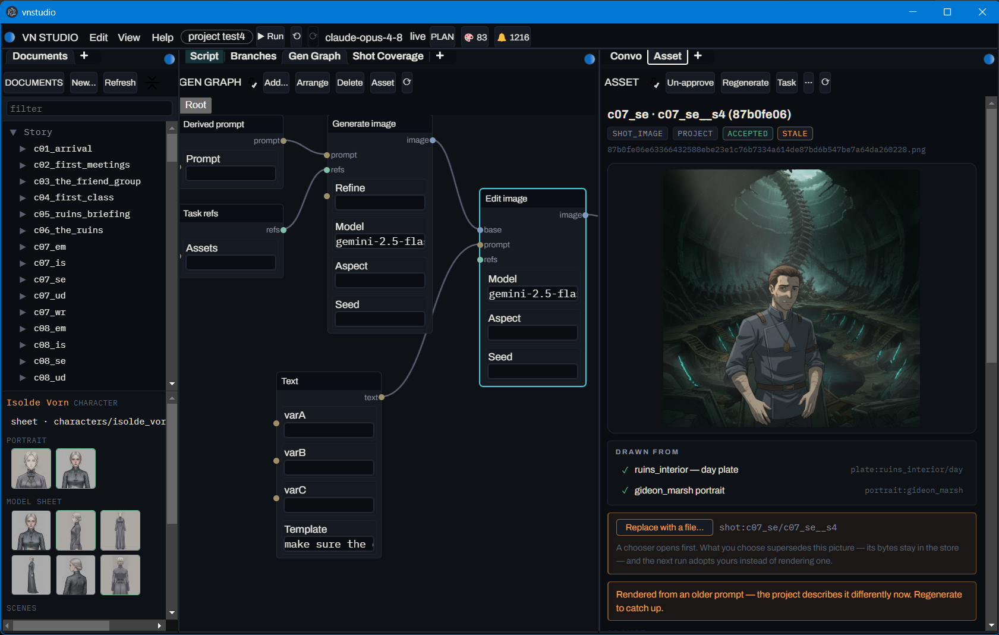

# Visual novel generator

Turns authored inputs — characters, a branching Fountain screenplay, locations — into
generated art plus a provenance manifest, and plays the result.



**Demo:** [a generated VN, published as a light novel](https://joeedh.github.io/test-visual-novel-1/) —
rendered from `examples/test4` by the GitHub Actions workflow the desktop app installs.
See [`docs/guides/github-pages.md`](docs/guides/github-pages.md) for how to publish your own.

Start at [`CLAUDE.md`](CLAUDE.md) for the map of the repository, or
[`docs/index.md`](docs/index.md) for the documentation index.

**Download the latest release:** [github.com/joeedh/visualnovel/releases](https://github.com/joeedh/visualnovel/releases)

## Building

```bash
pnpm setup:all
```
