# Slots as asset history

Research, 2026-09-20. Names the model the code has today for "a slot holds a history of
takes", lists where the code disagrees with itself about that model, and lays out options
for a formal one. A plan will be written from this; nothing here changes code.

<!-- toc -->

- [Summary](#summary)
- [The current model](#the-current-model)
    - [Glossary](#glossary)
    - [Six answers to which take is current](#six-answers-to-which-take-is-current)
    - [Where a take's state lives](#where-a-takes-state-lives)
    - [How a take enters a slot](#how-a-take-enters-a-slot)
    - [State diagram](#state-diagram)
    - [What the prior plans intended](#what-the-prior-plans-intended)
- [Catalogue of inconsistencies](#catalogue-of-inconsistencies)
    - [1. The approval popup lists takes a later render replaced](#1-the-approval-popup-lists-takes-a-later-render-replaced)
    - [2. The agent's `approve_assets` approves losing takes and un-approves the winner](#2-the-agents-approve_assets-approves-losing-takes-and-un-approves-the-winner)
    - [3. Regenerating a plate or sheet leaves the old take accepted and the new one current](#3-regenerating-a-plate-or-sheet-leaves-the-old-take-accepted-and-the-new-one-current)
    - [4. Adopting or promoting does not accept, so the tree and the editor disagree](#4-adopting-or-promoting-does-not-accept-so-the-tree-and-the-editor-disagree)
    - [5. The tree cannot order takes, and the docs say it does](#5-the-tree-cannot-order-takes-and-the-docs-say-it-does)
    - [6. A re-keyed slot empties for every surface except the tree and the exporter](#6-a-re-keyed-slot-empties-for-every-surface-except-the-tree-and-the-exporter)
    - [7. Prose drift and re-generation](#7-prose-drift-and-re-generation)
    - [8. A shot runner accepts on the machine's verdict; every other runner waits for a human](#8-a-shot-runner-accepts-on-the-machines-verdict-every-other-runner-waits-for-a-human)
    - [9. Adoption erases a task's attempt history](#9-adoption-erases-a-tasks-attempt-history)
    - [10. The inspector calls every earlier attempt "rejected"](#10-the-inspector-calls-every-earlier-attempt-rejected)
    - [11. "Newest take" is decided per task, not per take](#11-newest-take-is-decided-per-task-not-per-take)
    - [12. A sheet's slot membership lives in the task log, not the manifest](#12-a-sheets-slot-membership-lives-in-the-task-log-not-the-manifest)
    - [13. `stale` means two different things](#13-stale-means-two-different-things)
    - [14. Vocabulary drift](#14-vocabulary-drift)
    - [15. Smaller findings](#15-smaller-findings)
- [Options for a formal model](#options-for-a-formal-model)
    - [What every option needs](#what-every-option-needs)
    - [Option A. An explicit per-slot history record](#option-a-an-explicit-per-slot-history-record)
    - [Option B. Derive history purely from the task log behind one `slotHistory()` query](#option-b-derive-history-purely-from-the-task-log-behind-one-slothistory-query)
    - [Option C. A current-pointer file per slot; everything else is archive](#option-c-a-current-pointer-file-per-slot-everything-else-is-archive)
    - [Comparison](#comparison)
- [Open questions for the owner](#open-questions-for-the-owner)

<!-- tocstop -->

## Summary

- A slot is an address (`plate:cafe/night`) and nothing on disk is keyed by it. The
  manifest is keyed by content hash and sorted by hash; the task log is keyed by task
  hash. "The takes a slot has held" is recomputed on every read by filtering the manifest
  through `candidatesFor` (`packages/artgen/src/refs.ts:84-115`), and that filter has no
  order, no timestamps and no notion of which take replaced which.
- "Current take" has six independent definitions in the code (task output, `pick`,
  `Shot.image`, `approvedPortrait`, the exporter's first-accepted scan, and the tree's
  first-candidate fallback). They agree in the common case and diverge after regeneration,
  adoption, a re-key, or prose drift.
- Approval is a per-asset boolean (`Asset.accepted`) for every kind except portraits,
  where it is a pointer on the character sheet. Neither is tied to being current. A take
  can be accepted and not current, or current and not accepted, and the surfaces read the
  two facts through different filters.
- The approval popup lists stale takes because `approvable()`
  (`apps/desktop/src/main/session/gate.ts:128-134`) walks every candidate of every slot
  and filters only on `assetApproved`, never on whether a later take holds the slot. The
  `settled` flag it attaches is a note on the row, not a filter, and the agent's
  `approve_assets` ignores the flag altogether.
- Three options are laid out. All three need the same preliminary work: one shared
  `slotHistory()` query, a `via` and `at` on every attempt record, and a decision on
  whether a clean render is accepted by the machine or by a person.

## The current model

### Glossary

Each term below is defined by the code that implements it. Where two files use the word
differently, both are cited.

| Term              | What it means in the code                                                                                                                                                                                                                                                                                                                                                                            | Defined at                                                                                                                                                                                                             |
| ----------------- | ---------------------------------------------------------------------------------------------------------------------------------------------------------------------------------------------------------------------------------------------------------------------------------------------------------------------------------------------------------------------------------------------------- | ---------------------------------------------------------------------------------------------------------------------------------------------------------------------------------------------------------------------- |
| slot              | One picture the project implies, addressed by a `RefBinding` and spelled by `slotKey`: `portrait:<id>`, `sheet:<id>/<outfit>/<angle>`, `plate:<loc>/<variant>`, `shot:<scene>/<shot>`. The fifth `RefBinding` kind, `asset:<hash>`, is an address that `resolveSlot` refuses as `NOT_A_SLOT`. Nothing on disk is keyed by a slot key.                                                                | `packages/artgen/src/slotaddr.ts:17-30`, `packages/artgen/src/slotgraph.ts:232-239`                                                                                                                                    |
| slot graph        | Every slot the project implies, enumerated from the model and the persisted storyboards, with `refs` edges, a topological `order`, and per slot a `taskHash` (identity), `status`, `hash` (the resolved take), `candidates` (every take) and `approved`.                                                                                                                                             | `packages/artgen/src/slotgraph.ts:262-302`, `:305-379`                                                                                                                                                                 |
| identity          | The task hash the planner would assign the slot today, from the project as it stands. A `shot:` identity embeds its plate's and sheets' output hashes, so it does not exist until those are `done`.                                                                                                                                                                                                  | `packages/artgen/src/slotgraph.ts:89-100`, `:158-240`, `packages/taskgraph/src/hash.ts:14-16`                                                                                                                          |
| candidate         | Every manifest asset whose `kind` and `satisfies` bind it to a slot, accepted or not. For a `sheet:` slot the angle is not in `satisfies`, so membership additionally needs `angleOf(sourceTask)`, which reads the task log. The same word names a portrait draft at the P3 gate (`GateCandidate`, `Character.status: 'candidates'`) and a directory nothing writes (`characters/<id>/candidates/`). | `packages/artgen/src/refs.ts:84-115`, `apps/desktop/src/shared/ipc.ts:336-339`, `packages/types/src/entities.ts:9`, `packages/store/src/worktree.ts:87-97`                                                             |
| take              | A candidate, seen as one of several drafts of the same slot. The word appears in the tree (`takes:<key>`, "Another take of …"), in `AssetInfo.newerTake`, in `asset.restore` ("Put this take back"), in `supersededBy`'s doc comment and in `overAccepted`. No type is named `Take`.                                                                                                                 | `apps/desktop/src/main/doctree/doctree.ts:340-379`, `apps/desktop/src/main/session/asset.ts:115-121`, `apps/desktop/src/main/commands/asset.ts:125-135`                                                                |
| attempt           | One execution of one task: `TaskAttempt {attempt, prompt?, refs, output?, reviews?, error?, at?}`. A P7 refine pass pushes one per generated frame; a failed run pushes one carrying `error`; adoption writes exactly one synthetic `{attempt: 1}`. Attempts accumulate across regenerations of the same task hash because `requeue` spreads the old node.                                           | `packages/types/src/tasks.ts:51-62`, `packages/pipeline/src/runners.ts:288-296`, `packages/scheduler/src/scheduler.ts:412-419`, `packages/artgen/src/adopt.ts:86-97`, `apps/desktop/src/main/session/asset.ts:430-441` |
| current take      | Six definitions; see the next section. The one `AssetInfo.slot`, `newerTake`, adoption's `held` and the Replace strip read is "the `output` of the slot's identity task".                                                                                                                                                                                                                            | `apps/desktop/src/main/session/asset.ts:106-121`                                                                                                                                                                       |
| accepted          | `Asset.accepted: boolean`, one flag per manifest row. Exclusive per slot by convention: `store.accept(hash, supersede)` clears the flags in `supersede` in the same write, and `supersededBy` computes that list. Portraits and sheets-without-`angleOf` supersede nothing. `repairAccepted` puts a slot with two accepted takes back to one.                                                        | `packages/types/src/entities.ts:416`, `packages/store/src/assetstore.ts:176-189`, `packages/artgen/src/slotgraph.ts:252-259`, `packages/pipeline/src/repair.ts:25-44`                                                  |
| approved          | `assetApproved(asset, model)`: for a portrait, the character is `approved`/`locked` and `approvedPortrait === asset.hash`; for a concept or an upload, always true; otherwise `asset.accepted`. `SlotNode.approved` is the same asymmetry at slot level. The tree's `DocNode.approved` flag is this predicate; its `accepted` badge is the raw flag.                                                 | `packages/artgen/src/prereq.ts:54-67`, `packages/artgen/src/slotgraph.ts:351-354`, `apps/desktop/src/main/doctree/doctree.ts:315-320`                                                                                  |
| approved portrait | `Character.approvedPortrait` in `character.md` front matter plus `approved.png` on disk, written by `gate.approve`. `resolveBinding` answers a `portrait:` slot from this field and never from the manifest.                                                                                                                                                                                         | `packages/types/src/entities.ts:109-110`, `packages/store/src/worktree.ts:115-139`, `packages/artgen/src/refs.ts:121-126`, `apps/desktop/src/main/session/gate.ts:64-99`                                               |
| settled           | `Approvable.settled`: the slot this row is a candidate of already has an answer (`SlotNode.approved`). The tree uses the same word for "`slot.hash` is one of the takes".                                                                                                                                                                                                                            | `packages/authoring/src/approve.ts:56-64`, `apps/desktop/src/main/session/gate.ts:154-157`, `apps/desktop/src/main/doctree/doctree.ts:348`                                                                             |
| superseded        | A take a later render or adoption replaced. `AdoptRequest.replace` is the declared act of superseding; `ALREADY_RENDERED` is the refusal without it. The archived plan of that name defined superseded as "a candidate not in the slot's current set".                                                                                                                                               | `packages/artgen/src/adopt.ts:28-35`, `:71-83`, `packages/artgen/src/adoptslot.ts:202-210`                                                                                                                             |
| adopted           | Bytes already in the store re-recorded under the slot's kind, with `sourceTask` set to the slot's identity, and that identity logged `done` with those bytes as `output`. The one `done` record written outside the scheduler. Never accepts.                                                                                                                                                        | `packages/artgen/src/adoptslot.ts:244-296`                                                                                                                                                                             |
| promoted          | A concept adopted onto `plate:<loc>/<variant>` after the variant is written to the sheet. The manifest row is rewritten in place: `kind` flips to `location_ref`, `sourceTask` and `prompt` are replaced, the concept binding is kept beside the plate binding by `mergeBindings`.                                                                                                                   | `packages/artgen/src/promote.ts:117-171`, `packages/store/src/assetstore.ts:41-45`, `:142-158`                                                                                                                         |
| restored          | `asset.restore`: adopt with `replace` and `keepPrompt`, then `asset.accept`, as one act. The only path that both moves the identity's `output` and moves `accepted`.                                                                                                                                                                                                                                 | `apps/desktop/src/main/session/asset.ts:1001-1023`                                                                                                                                                                     |
| concept           | An asset with `kind: 'concept'`, `sourceTask` a hash of the request rather than a node, bound to a subject and consumed by nothing. `art.redraw` writes a second concept beside it; nothing links the two except the shared binding.                                                                                                                                                                 | `packages/artgen/src/concept.ts:83-119`, `:221-245`                                                                                                                                                                    |
| suspended         | Derived on every read, never stored: a `ChunkRef` pinned to a hash whose slot now resolves to a different hash, or anything downstream of such an asset. Cleared by `prompt.repin`.                                                                                                                                                                                                                  | `packages/artgen/src/suspend.ts:40-87`, `packages/artgen/src/refs.ts:137-141`                                                                                                                                          |
| stale (prompt)    | `AssetInfo.stale`: the prompt the builders derive today differs from the prompt recorded on the bytes. Produced by an art-notes or override edit. The asset's `sourceTask` is then an orphan.                                                                                                                                                                                                        | `apps/desktop/src/main/session/asset.ts:95-97`, `:139-141`                                                                                                                                                             |
| stale (prose)     | The tree's `stale` badge and its "Stale assets" branch: `driftOf(scene, shot) === 'drifted'`, read off `Shot.image` and `Shot.proseHash`. A frame only.                                                                                                                                                                                                                                              | `apps/desktop/src/main/doctree/doctree.ts:287-295`, `packages/pipeline/src/drift.ts:26-27`                                                                                                                             |
| drifted (graph)   | A bound generation graph's authored hash differs from the journal's last `done` record. `requeueDrifted` puts the task back to `pending` with `output: undefined`.                                                                                                                                                                                                                                   | `packages/scheduler/src/scheduler.ts:174-188`                                                                                                                                                                          |
| orphan            | A task hash in `tasks.jsonl` that no planning pass asks for any more. `TaskGraph.prune` exists and nothing calls it. `asset.regenerate` refuses an asset whose task is an orphan unless the slot's live identity is `failed` or `needs_human`.                                                                                                                                                       | `packages/taskgraph/src/graph.ts:94-103`, `apps/desktop/src/main/session/asset.ts:379-384`                                                                                                                             |
| `Shot.status`     | `'pending' \| 'prompted' \| 'generated' \| 'accepted' \| 'needs_human'` in `work/shots/<scene>.json` under `shotData`. Written by `refreshShotData` from the task's status (`done` → `accepted`) and by the shot runner. `generated` is never assigned. The Shot Coverage strip uses it as a CSS class.                                                                                              | `packages/types/src/entities.ts:310`, `packages/pipeline/src/planner.ts:166-193`, `apps/desktop/renderer/pathux/editors/timeline.ts:605`                                                                               |

### Six answers to which take is current

| Reader                                                                                                         | Rule                                                                                                                                                                                               | Code                                                                                                                                     |
| -------------------------------------------------------------------------------------------------------------- | -------------------------------------------------------------------------------------------------------------------------------------------------------------------------------------------------- | ---------------------------------------------------------------------------------------------------------------------------------------- |
| Planner (downstream identity), `AssetInfo.slot`/`newerTake`, adoption's `held`, Replace strip, `pipeline.draw` | `graph.get(slotTaskHash(resolveSlot(slot))).output` when that task is `done`. Empty while the identity is `pending`, `failed` or `needs_human`, and empty after a re-key until the new task lands. | `packages/pipeline/src/planner.ts:229-233`, `apps/desktop/src/main/session/asset.ts:106-121`, `packages/artgen/src/adoptslot.ts:202-210` |
| `resolveBinding` → `SlotNode.hash`, `refDrift`, suspension, the tree's row head, `pipeline:status`             | `pick(candidatesFor(slot))`: the one accepted candidate; else the sole candidate; else nothing. Manifest order among unaccepted candidates is hash order.                                          | `packages/artgen/src/refs.ts:64-69`, `:118-130`                                                                                          |
| Portrait slot                                                                                                  | `Character.approvedPortrait`; the manifest is not consulted.                                                                                                                                       | `packages/artgen/src/refs.ts:121-126`                                                                                                    |
| Storyboard, Shot Coverage strip, tree double-click, `overAccepted` tiebreak                                    | `Shot.image` in `work/shots/<scene>.json`, which `refreshShotData` sets from the task on every planning pass and deletes when the identity is not terminal.                                        | `packages/pipeline/src/planner.ts:166-193`, `apps/desktop/src/main/session/story.ts:436`, `packages/artgen/src/overaccept.ts:41-58`      |
| Exporter                                                                                                       | The first manifest row with `kind: 'shot_image'`, binding `shotId`, and `accepted`. The first accepted portrait when `approvedPortrait` is unset.                                                  | `packages/export/src/playable.ts:133-152`                                                                                                |
| Tree head when `pick` declines; Gen Graph pane's Show asset                                                    | `candidates[0]`, which is the lowest hash.                                                                                                                                                         | `apps/desktop/src/main/doctree/doctree.ts:348-349`, `apps/desktop/renderer/pathux/editors/nodes.ts:613-628`                              |

### Where a take's state lives

| Fact                                                            | Stored at                                                                                                        | Notes                                                                                                                                                                                                                                                              |
| --------------------------------------------------------------- | ---------------------------------------------------------------------------------------------------------------- | ------------------------------------------------------------------------------------------------------------------------------------------------------------------------------------------------------------------------------------------------------------------ |
| The bytes                                                       | `assets/objects/<hash>.<ext>` or `vngen/build/assets/<hash>.<ext>`, routed by kind                               | Nothing removes bytes. `docs/reference/asset-stores.md:140-149`.                                                                                                                                                                                                   |
| Kind, `sourceTask`, prompt, refs, bindings, `accepted`, `title` | One row per hash in the root's `manifest.json`, sorted by hash                                                   | No timestamp, no order, no predecessor. `Asset.params` is declared (`packages/types/src/entities.ts:409`) and never written (`packages/store/src/assetstore.ts:143-158`).                                                                                          |
| Which task produced it, when, after which reviews               | `TaskAttempt` on the task's last snapshot in `vngen/state/tasks.jsonl`; `loadGraph` keeps the last line per hash | `at` is stamped by the scheduler only; adoption's synthetic attempt has none. `packages/taskgraph/src/log.ts:18-25`.                                                                                                                                               |
| Which take the identity currently outputs                       | `Task.output` on that snapshot                                                                                   | Cleared by `requeue`, `requeueDrifted`; replaced by a run or an adoption.                                                                                                                                                                                          |
| Which take a shot shows                                         | `shotData.image` and `shotData.proseHash` in `work/shots/<scene>.json`                                           | Rewritten wholesale each planning pass. `packages/store/src/shots.ts:224-238`.                                                                                                                                                                                     |
| Which portrait is approved                                      | `approved_portrait:` and `status:` in `character.md`, plus `approved.png`                                        | Also mirrored as `accepted` on the manifest row by `approveCharacter` (`apps/desktop/src/main/session/gate.ts:89`); the only reader of that mirror is the exporter's fallback for a sheet with no `approved_portrait` (`packages/export/src/playable.ts:149-151`). |
| Human approval of anything else                                 | `accepted` on the manifest row                                                                                   | Set by `asset.accept`, `asset.restore`, and by the shot runner on a clean review.                                                                                                                                                                                  |
| Suspension, prompt staleness, prose drift, graph drift          | Not stored; derived on every read                                                                                | By design (`docs/reference/pipeline-contracts.md:474-482`).                                                                                                                                                                                                        |

### How a take enters a slot

| Path                                 | Writes the manifest row as                                                                                   | Writes the task log                                               | Accepts                                                | Stamps `Shot.image`                       | Code                                                             |
| ------------------------------------ | ------------------------------------------------------------------------------------------------------------ | ----------------------------------------------------------------- | ------------------------------------------------------ | ----------------------------------------- | ---------------------------------------------------------------- |
| Scheduled run, plate/portrait/sheet  | `kind`, `sourceTask: task.hash`, binding                                                                     | `done` with `output`; attempts unchanged (none pushed on success) | No                                                     | n/a                                       | `packages/pipeline/src/runners.ts:145-201`                       |
| Scheduled run, shot, clean review    | as above                                                                                                     | `done` with `output`; one attempt per generated frame             | Yes, superseding every other accepted take of the slot | Next planning pass, via `refreshShotData` | `packages/pipeline/src/runners.ts:296-309`                       |
| Scheduled run, shot, `needs_human`   | as above (one row per attempt)                                                                               | `needs_human` with `output: lastRef`                              | No                                                     | Next pass, from the last attempt          | `packages/pipeline/src/runners.ts:330-337`, `planner.ts:181-186` |
| Bound generation graph               | Same `store.write` and meta as the unbound runner                                                            | Same as the runner; the graph's own journal advances separately   | Same as the runner                                     | Same                                      | `packages/pipeline/src/graphrun.ts:336-350`, `runners.ts:78-89`  |
| `gengraph.run` (interactive)         | Nothing                                                                                                      | Nothing                                                           | No                                                     | No                                        | `docs/reference/gen-graphs.md:457-463`                           |
| `asset.regenerate` / `pipeline.draw` | as a run; the task is first logged `pending` with `output: undefined` and the old `attempts` kept            | as a run                                                          | as a run                                               | as a run                                  | `apps/desktop/src/main/session/asset.ts:414-441`                 |
| `asset.adopt` (upload → slot)        | Re-records the hash under the slot's kind with `sourceTask` = identity; `mergeBindings` keeps prior bindings | `done` with `output`; `attempts` replaced by one `{attempt: 1}`   | No                                                     | Yes, with `proseHash`                     | `packages/artgen/src/adoptslot.ts:254-296`, `adopt.ts:86-97`     |
| `asset.replace`                      | `asset.upload` then `asset.adopt(replace)`                                                                   | as adopt                                                          | No                                                     | as adopt                                  | `apps/desktop/src/main/session/asset.ts:1038-1045`               |
| `art.promote`                        | Rewrites the concept row in place (kind, `sourceTask`, `prompt`)                                             | as adopt                                                          | No                                                     | n/a                                       | `packages/artgen/src/promote.ts:156-161`                         |
| `asset.restore`                      | as adopt with `keepPrompt`                                                                                   | as adopt                                                          | Yes, superseding                                       | as adopt                                  | `apps/desktop/src/main/session/asset.ts:1001-1023`               |
| `gate.approve`                       | `accepted: true` on the portrait row                                                                         | Nothing                                                           | Yes, superseding nothing                               | n/a                                       | `apps/desktop/src/main/session/gate.ts:64-99`                    |
| `art.generate` / `art.redraw`        | A `concept` row, `sourceTask` = request hash                                                                 | Nothing                                                           | No                                                     | n/a                                       | `packages/artgen/src/concept.ts:101-112`, `:228-237`             |

### State diagram

For one take T of a non-portrait slot S, the observable state is the tuple (is T the
identity's `output`, is T `accepted`, does the identity still exist). The derived marks
(suspended, stale, drifted) are orthogonal and are listed after.

```mermaid
stateDiagram-v2
    [*] --> Unrendered : slot enumerated, no candidate
    Unrendered --> HeadUnaccepted : run / adopt / promote writes T as output
    HeadUnaccepted --> HeadAccepted : asset.accept · shot runner clean review · asset.restore
    HeadAccepted --> HeadUnaccepted : asset.unapprove
    HeadAccepted --> ReplacedAccepted : run regenerates (plate / sheet) · adopt(replace) without accept
    HeadAccepted --> Replaced : shot runner clean review of a new frame (supersedes T) · asset.accept of another take
    HeadUnaccepted --> Replaced : any later render or adoption
    ReplacedAccepted --> Replaced : asset.accept of the head · repairAccepted
    Replaced --> HeadAccepted : asset.restore
    Replaced --> ReplacedAccepted : asset.accept (flag only; slot still names the later render)
    HeadAccepted --> Orphaned : art notes / override / seed / outfit / heading edit re-keys S
    HeadUnaccepted --> Orphaned : same
    Orphaned --> HeadAccepted : the re-keyed task lands and T's bytes are re-recorded under it (same bytes, fixed seed)
    Orphaned --> Replaced : the re-keyed task lands with different bytes
```

- `HeadUnaccepted` — `task.output === T`, `!T.accepted`. `AssetInfo.slot` set; tree head
  if T is the sole candidate or if `pick` declines and T sorts first; listed in the
  approval popup.
- `HeadAccepted` — `task.output === T`, `T.accepted`. Every reader agrees.
- `ReplacedAccepted` — `task.output !== T`, `T.accepted`. `pick` still returns T, so the
  tree, `refDrift`, suspension and the exporter use T; the planner and the Replace strip
  use the newer output. This state is reachable today by regenerating any non-shot slot
  (finding 3) or by `asset.adopt` without `asset.restore` (finding 4).
- `Replaced` — `task.output !== T`, `!T.accepted`. Folded under the head in the tree;
  still listed in the approval popup (finding 1) with `settled` only when the head is
  accepted.
- `Orphaned` — `T.sourceTask` is no longer any slot's identity. `AssetInfo.stale` where a
  derivation exists; `asset.regenerate` refuses; the tree still lists T as a candidate of
  S, because `candidatesFor` reads bindings, not identities.

Derived marks that can attach to any of these:

- suspended (`suspendedAssets`), which refuses `asset.accept`, `gate.approve` and
  `asset.restore`;
- prose-drifted (`driftOf`), which removes a frame from the popup and the "Awaiting
  approval" group and files it under "Stale assets" while it stays accepted;
- graph-drifted (`graphDrift`), which requeues the task at the next run.

A `portrait:` take has a different, simpler diagram: unrendered → drafted (in the
manifest) → approved (`approvedPortrait === T`) ↔ drafted (`asset.unapprove`). It never
enters `Replaced` through a run, because `runPortrait` writes a second draft beside the
first and nothing supersedes; the gate alone chooses, and choosing a new one leaves the
old one as a draft with `accepted: true` still on its row
(`apps/desktop/src/main/session/gate.ts:89` sets the flag; `approveCharacter` never clears
the previous portrait's flag, and `supersededBy` returns `[]` for a portrait).

### What the prior plans intended

- the-full-slot-graph-and-approving-upstream-first (archived 2026-08-17): `hash` and
  `candidates` are two answers and both are needed; "Awaiting approval" lists every
  candidate the approval rule says no to; empty `candidates` is the one meaning of "not
  yet rendered". The plan did not define a take order or a predecessor relation.
- superseded-assets-in-the-document-tree (archived 2026-08-18): "superseded" is "a
  candidate of some slot that is not in that slot's current set", where the current set is
  `slot.hash` when it resolved and every candidate when it did not. The as-shipped note
  records the later change to one row per slot with the earlier takes nested under it, and
  says the rule about what is current "survived intact".
- adopting-an-uploaded-asset (archived 2026-08-15): adoption never accepts; superseding a
  real render is a declared act (`replace`); the superseded bytes stay in the store.
- `pipeline.approveAndRun`'s notes (`apps/desktop/src/main/commands/pipeline.ts:259`)
  state that "a finished project still lists the takes that lost", and that the bulk pass
  skips them through `settled`. The popup's listing of losing takes is therefore a
  documented decision, and the confusion the owner reports is with that decision rather
  than with a defect in implementing it.

## Catalogue of inconsistencies

Each entry names the code and the symptom an author sees.

### 1. The approval popup lists takes a later render replaced

- `approvable()` (`apps/desktop/src/main/session/gate.ts:108-162`) walks `slots.order`
  and, for each slot, every hash in `slot.candidates` (`:128`). The only exclusions are a
  hash already listed, a prose-drifted frame, and `assetApproved` (`:134`). There is no
  test against the slot's identity output, `SlotNode.hash`, or any predecessor relation.
- A take that lost is marked `settled: true` only when `slot.approved` is true (`:157`).
  When the head is unaccepted (a regenerated plate nobody has accepted yet), the old take
  and the new take are both listed as plain rows, distinguishable only by the `(hash8)`
  suffix `labelAssets` adds on a label collision.
- The renderer draws every item (`apps/desktop/renderer/rules/approvals.ts:34-36`) and
  `notesFor` (`apps/desktop/renderer/pathux/chrome/approvals.ts:141-149`) turns `settled`
  into a note under the row rather than into a filter.
- The "Awaiting approval" tree group (`apps/desktop/src/main/doctree/doctree.ts:446-463`)
  applies the identical filter, so the two agree with each other and both list stale
  takes. `docs/reference/document-tree.md:100-103` states that agreement as the goal.
- Symptom: a project that rendered a plate four times shows three "waiting" rows for it
  after the fourth is accepted, forever, each saying "Another take for this slot is
  already approved — approving this one replaces it." A project with a regenerated but
  unaccepted plate shows two rows with the same name.

### 2. The agent's `approve_assets` approves losing takes and un-approves the winner

- `approve_assets` (`packages/authoring/src/tools/assets.ts:268-303`) takes
  `ctx.approval.list()` (which is `approvable()`), lets the triage model choose, holds
  back `blocked` rows (`:286-287`) and approves the rest in list order (`:300-303`). It
  never reads `settled`.
- `toApprove` in `pipeline.approveAndRun`
  (`apps/desktop/src/main/commands/pipeline.ts:233-247`) skips `settled` rows and takes
  one row per slot, and its notes explain why.
- `acceptAsset` un-accepts the other accepted takes of the slot on every call
  (`apps/desktop/src/main/session/asset.ts:230`).
- Symptom: an author who says "approve everything" to the agent, in a project with a
  settled plate and two losing takes, gets a confirmation card naming all three; approving
  them in hash order leaves whichever sorts last as the accepted plate, which is not the
  one the slot's identity outputs and not the one the author chose earlier.

### 3. Regenerating a plate or sheet leaves the old take accepted and the new one current

- `runLocationRef`, `runPortrait` and `runModelSheet` return `done` without calling
  `store.accept` (`packages/pipeline/src/runners.ts:145-201`). Only the shot runner
  accepts and supersedes (`:296-309`).
- `asset.regenerate` logs the task `pending` with `output: undefined`
  (`apps/desktop/src/main/session/asset.ts:430-441`) and the run writes the new bytes and
  sets `output` to them. The old row keeps `accepted: true`.
- `pick` returns the single accepted candidate (`packages/artgen/src/refs.ts:64-69`), so
  `resolveBinding` → old; the planner's `doneOutput` → new
  (`packages/pipeline/src/planner.ts:229-233`, `:338`). Downstream shots are re-keyed on
  the new plate and re-render from it.
- `refDrift` compares the pin against `resolveBinding`
  (`packages/artgen/src/refs.ts:137-141`), which still answers the old accepted hash, so
  nothing pinned to the old plate is reported as suspended even though the runner no
  longer uses it.
- Symptoms: the tree row for the plate shows the old picture with the `accepted` badge and
  folds the new render under it as "Another take"; the Asset editor on the old picture
  shows "Un-approve" (`apps/desktop/renderer/rules/assetview.ts:110`) and reports a
  `newerTake`, so a pane that was showing the old plate when the render landed follows it
  to the new one (`watchSlot`, `:605-608`), whose header offers "Accept"; plates are not
  exported, but the frames the next run draws are drawn from the new plate.
  `repairAccepted` does not intervene, because only one take is accepted.

### 4. Adopting or promoting does not accept, so the tree and the editor disagree

- `adoptSlot` is documented as never accepting (`packages/artgen/src/adoptslot.ts:252`)
  and `promoteConcept` calls it (`packages/artgen/src/promote.ts:158-161`). `store.write`
  keeps the row's prior `accepted` (`packages/store/src/assetstore.ts:154`), which for an
  upload or a concept is `false`.
- With `replace`, the render that held the slot stays accepted; the adopted bytes become
  the identity's `output`. This is the same `ReplacedAccepted` state as finding 3, reached
  by a different path.
- `asset.restore` is the one path that avoids it, by calling `acceptAsset` after adopting
  (`apps/desktop/src/main/session/asset.ts:1012-1016`).
- Symptom: after "Replace" on a plate, the tree still heads the slot with the old render
  (accepted) and files the author's file as "Another take"; the Asset editor on the old
  render shows no Replace strip (because `AssetInfo.slot` is unset, `:111`) but does show
  "Un-approve"; the Asset editor on the new file shows the Replace strip and "Accept".
  Promotion of a concept with no prior plate has no such conflict because there is nothing
  accepted; promotion over an existing plate needs `replace`, which `art.promote` does not
  pass (`packages/artgen/src/promote.ts:158-161`), so it is refused as `ALREADY_RENDERED`.

### 5. The tree cannot order takes, and the docs say it does

- `docs/reference/document-tree.md:127-135`: "The other three sit underneath it, newest
  first".
- `apps/desktop/src/main/doctree/doctree.ts:336-339`: "Left in candidate order, which is
  the manifest's hash order: nothing in this projection records when a picture was
  rendered, so the list is a set rather than a history and no row may be presented as the
  latest." Line `:388` of the same file then says "The takes folded under a row keep their
  own order, which is a history."
- The manifest is written sorted by hash (`packages/store/src/assetstore.ts:221-228`) and
  carries no time. The only timestamps are `TaskAttempt.at`, which the tree does not read.
- Symptom: the folded takes appear in an order that changes as hashes change, and an
  author reading the doc expects the top one to be the previous take.

### 6. A re-keyed slot empties for every surface except the tree and the exporter

- An art-notes, override, seed, outfit or heading edit gives the slot a new identity. The
  new task is `pending`; the old task stays `done`; the old bytes stay bound.
- `AssetInfo.slot` and `newerTake` read the new identity's output, which is empty, so
  every take of the slot reports no slot and no newer take
  (`apps/desktop/src/main/session/asset.ts:111-121`). `watchSlot` documents this window
  (`apps/desktop/renderer/rules/assetview.ts:596-608`).
- At the next planning pass `refreshShotData` deletes `Shot.image` because the new
  identity is not terminal (`packages/pipeline/src/planner.ts:188-192`), so the Shot
  Coverage strip shows no frame and `driftedFrames` reports no drift. Until that pass the
  storyboard still names the old frame, so the strip's answer depends on whether a run has
  started since the edit.
- `pick` still answers the old accepted take, so the tree heads the slot with it, badged
  `accepted`, and the exporter still ships it.
- Symptom: the same edit makes the strip say "no frame yet", the tree say "accepted", and
  the Asset editor say "Rendered from an older prompt", about one picture.

### 7. Prose drift and re-generation

- Retyping a covered line moves nothing in the task hash; the frame stays `done`,
  `accepted`, and `Shot.image` still names it. `driftOf` reports `drifted`; the tree files
  it under "Stale assets" and the popup omits it.
- The author's route to a redraw is `asset.regenerate` (or `pipeline.draw`), which
  requeues the same identity. The shot runner then writes a new frame and, on a clean
  review, accepts it and supersedes the old (`packages/pipeline/src/runners.ts:296-309`).
  On a `needs_human` outcome it accepts nothing: the old frame stays accepted,
  `Shot.image` moves to the new frame (`packages/pipeline/src/planner.ts:181-186`),
  `proseHash` is restamped against the new bytes, and the exporter keeps shipping the old
  accepted frame.
- Symptoms: after a drift redraw that lands on `needs_human`, the strip shows the new
  frame, the tree heads the slot with the old one (badge `accepted`, no longer `stale`
  because `Shot.image` moved), the popup lists the new frame as waiting, and the playable
  shows the old frame. The owner's description ("a new take while the old one stays
  approved") is this case; the clean-review case does supersede.

### 8. A shot runner accepts on the machine's verdict; every other runner waits for a human

- `SlotNode.approved` is documented as "Whether a human has approved what fills this slot"
  (`packages/artgen/src/slotgraph.ts:287-293`) and `assetApproved` as "Whether a human has
  blessed these bytes" (`packages/artgen/src/prereq.ts:45-53`).
- The shot runner sets `accepted` itself when no reviewer reports a blocking defect
  (`packages/pipeline/src/runners.ts:298-309`). No person is involved. The comment there
  gives the reason (two accepted candidates would unresolve the slot), which is a reason
  to supersede, not a reason to accept.
- Symptom: a freshly rendered frame appears under `approved` rows and never in the popup,
  while a freshly rendered plate appears in the popup. The `approve_assets` card and the
  `pipeline.approveAndRun` pass both treat frames as already approved. Un-approving a
  frame and re-running the pipeline re-approves it without a person.

### 9. Adoption erases a task's attempt history

- `adoptionOf` builds its record from `makeTask` (fresh `attempts: []`) and sets
  `attempts: [{attempt: 1, …}]` (`packages/artgen/src/adopt.ts:86-97`). `loadGraph` keeps
  the last line per hash (`packages/taskgraph/src/log.ts:18-25`), so the previous attempts
  of that identity, with their reviews and `at` stamps, are no longer reachable through
  the graph. The lines stay in the file; nothing reads earlier lines.
- `asset.restore` and `asset.replace` go through this path, so restoring a take over a
  rendered one discards the refine-loop record the inspector shows, and `lastRenderedAt`
  (`packages/artgen/src/overaccept.ts:72-86`) then finds no `at` for the identity.
- Symptom: the Task inspector for a restored slot shows one attempt with no reviews and no
  time.

### 10. The inspector calls every earlier attempt "rejected"

- `attemptOutcome` (`apps/desktop/renderer/rules/attempts.ts:81-87`) returns `rejected`
  for every attempt but the last of a `done` task, and `accepted` for the last.
- After `asset.regenerate` the attempts accumulate (finding 3's `requeue` keeps them), so
  the attempt that produced a plate still accepted in the manifest is labelled `rejected`,
  and the attempt that produced the unaccepted head is labelled `accepted`.

### 11. "Newest take" is decided per task, not per take

- `overAccepted` prefers, for a non-shot slot, the take whose `sourceTask` has the latest
  attempt (`packages/artgen/src/overaccept.ts:57-61`). `lastRenderedAt` is keyed by task
  hash. Two takes of one identity (a regeneration without a re-key) share a `sourceTask`
  and get the same stamp, so the tiebreak falls to hash order.
- Nothing else in the code computes recency. `pipeline-contracts.md:159-161` states that a
  surface that cannot resolve a slot must report that rather than guess which take is
  newest, which is the constraint every surface above is working around.

### 12. A sheet's slot membership lives in the task log, not the manifest

- `satisfies` on a sheet binds `{characterId, outfit}` only; the angle is in the task's
  inputs (`packages/pipeline/src/runners.ts:174-180`). `candidatesFor` for a `sheet:` slot
  filters through `angleOf(sourceTask)` (`packages/artgen/src/refs.ts:92-101`), which
  reads the graph (`apps/desktop/src/main/assets/assetlabel.ts:19-30`).
- A sheet whose task is absent from `tasks.jsonl` (a base repo cloned without the
  project's state, or a hand-copied manifest) is a candidate of no slot, gets no angle in
  its label, and is listed as an orphan row. `supersededBy` and `overAccepted` skip sheets
  without `angleOf` (`packages/artgen/src/slotgraph.ts:255`, `overaccept.ts:50`), so
  acceptance exclusivity is never enforced for sheets in that state.
- This matters for any option that files history in the base root: the base manifest
  cannot say which of four sheet rows is which angle.

### 13. `stale` means two different things

- `AssetInfo.stale` and the Asset editor's `stale` badge: the derived prompt differs from
  the recorded one (`apps/desktop/src/main/session/asset.ts:139-141`,
  `apps/desktop/renderer/rules/assetview.ts:614`).
- The tree's `stale` badge and "Stale assets" branch: prose drift on a frame
  (`apps/desktop/src/main/doctree/doctree.ts:317`, `:287-295`).
- A plate with edited art notes is `stale` in the editor and not in the tree; a frame with
  retyped prose is `stale` in the tree and not in the editor.

### 14. Vocabulary drift

- `Approvable.kind` is documented as "`sheet`, `plate`, `shot`, `portrait`"
  (`packages/authoring/src/approve.ts:41-42`) and filled with the manifest kind
  (`model_sheet`, `location_ref`, …) at `apps/desktop/src/main/session/gate.ts:149`. The
  offline triage's `mentions` matches the author's words against that value (`:212-219`),
  so "approve the plates" matches only through the slot label.
- Three types are called a binding: `AssetBinding` (a manifest `satisfies` entry),
  `RefBinding` (a slot address, including the non-slot `asset:` kind), `GraphBinding` (a
  slot-to-graph entry).
- "candidate" names a slot's take (`SlotNode.candidates`), a portrait draft
  (`GateCandidate`), a character status (`'candidates'`), and a directory the CLI points
  authors at (`apps/cli/src/commands.ts:550`) that no runner writes (`writeCandidate` has
  no caller outside `packages/store/src/worktree.ts:87-97`).
- "accepted" names the manifest flag, a `Shot.status` value set by the planner from
  `done`, and an `AttemptOutcome` set by list position. "approved" names `assetApproved`,
  `SlotNode.approved`, `DocNode.approved`, a character status, and the gate's pointer.
- "draft" appears in comments (`packages/artgen/src/refs.ts:75-77`,
  `packages/authoring/src/approve.ts:5`) and as `Character.status: 'draft'`, which means
  "no portrait drawn yet", the opposite of a take.

### 15. Smaller findings

- `approveCharacter` sets `accepted` on the chosen portrait and never clears it on the
  previous one (`apps/desktop/src/main/session/gate.ts:89`; `supersededBy` returns `[]`
  for portraits). After two approvals a character has two `accepted` portrait rows.
  `assetApproved` ignores the flag for portraits, so nothing reads it, but `list_assets`
  prints it (`packages/authoring/src/tools/assets.ts:100`) and the tree's `accepted` badge
  draws it.
- `prereqOf` treats a prerequisite hash missing from the manifest as approved
  (`packages/artgen/src/prereq.ts:89-96`). Any future deletion of a take must account for
  this arm, or deleting an unapproved plate approves every frame drawn from it.
- Promotion rewrites the concept row's `sourceTask`
  (`packages/artgen/src/adoptslot.ts:269-281`), so the request hash that made the sketch
  survives only in git history of the manifest. `art.redraw` records `from` in its result
  and nowhere on disk (`packages/artgen/src/concept.ts:238-244`).
- `docs/reference/document-tree.md:134-135` ends mid-sentence ("and on the newest
  candidate where it").
- `Asset.params` is declared and never written (see the storage table above).

## Options for a formal model

### What every option needs

These are independent of which option is chosen and are the work a plan would do first.

- One query, `slotHistory(slot, ctx): Take[]`, in `@vn/artgen`, that every surface reads
  instead of `slot.candidates`: the popup, the "Awaiting approval" group, the Assets
  branch, `AssetInfo`, `approvable()`/`approvedAssets()`, `list_assets`, `overAccepted`,
  the Gen Graph pane's Show asset, and the exporter. A `Take` carries `hash`, `taskHash`,
  `via` (`run` | `graph` | `adopt` | `promote` | `restore` | `upload`), `at`, `accepted`,
  `current`, and `predecessor?`. Which fields are stored and which are derived is what the
  options differ on.
- `via` and `at` on every `TaskAttempt` (additive fields outside the hash; adoption stamps
  both). Without them the log cannot tell an adopted take from a rendered one.
- A decision on finding 8: either every runner accepts a clean render (and "approved"
  stops meaning "a human"), or none does and the shot runner only supersedes. The popup's
  contents follow from this decision.
- A decision on whether the popup lists losing takes at all (finding 1). The three options
  below assume it lists only takes that are current for their slot and not yet approved,
  and that losing takes are reachable from the tree and the Asset editor's take strip.
- The `stale` word split into two (finding 13), and `Approvable.kind` made a slot kind
  (finding 14).

### Option A. An explicit per-slot history record

A stored record per slot listing its takes in order, with one marked current and approval
recorded per take.

- Shape. `vngen/state/slots.jsonl`, append-only like `tasks.jsonl`, one line per event:
  `{v, slot, hash, taskHash, via, at, event: 'take' | 'current' | 'accept' | 'unaccept' | 'forget'}`.
  Replay (last event per (slot, hash) for accept; last `current` per slot) yields the
  record. A per-slot JSON file (`vngen/state/slots/<key>.json`) is the alternative; the
  JSONL form is preferred because slot keys contain `/` and because git union-merges an
  append-only file the way it already merges `tasks.jsonl`.
- Schemas. New zod schema in `@vn/types` for the event line. `Asset.accepted` stays for
  one release as a mirror, then is removed from the manifest schema.
  `Character.approvedPortrait` stays as the gate's authority; the record mirrors it as
  `current` + `accept` for the `portrait:` slot, written by `gate.approve` and
  `asset.unapprove`.
- Migration. On first open of a project without the file, build it from the manifest and
  the task log: for each slot in the slot graph, each candidate becomes a `take` event
  with `at` from the newest attempt naming that hash (else none), `via: 'run'` (or
  `'adopt'` when the attempt has no `at` and no reviews), `accept` from `Asset.accepted`,
  `current` from the identity's `output`. Order among takes with no `at` is log line
  order, then hash. The migration is idempotent and runs where `repairAccepted` runs today
  (`apps/desktop/src/main/session/core.ts:637`, the scheduler's pre-run pass).
- Writers. The scheduler on `done` and `needs_human`; `adoptSlot`;
  `store.accept`/`unaccept` (moved out of the store into a `SlotLedger` in `@vn/artgen`
  that the store no longer knows about); `gate.approve`; `repairAccepted` becomes a ledger
  consistency check.
- What the gate reads. Unchanged for portraits. `sceneUnblocked` keeps reading the
  character sheet.
- What the tree, editor, popup and agent read. `slotHistory` over the record. The Assets
  branch orders by `at` descending, heads with `current`, and can badge each take with
  `via`. The popup lists `current && !accepted`. `AssetInfo.newerTake` becomes
  `history.find(current)`. `attemptOutcome` reads the record rather than list position.
- Adoption, promotion, graph outputs. Each appends a `take` with its `via` and a `current`
  event. Promotion appends `take` with `via: 'promote'` and keeps the concept's original
  `sourceTask` in the event, which answers finding 15's provenance loss without touching
  the manifest row.
- Drift and suspension. Still derived, unchanged; they read `current` from the record
  instead of from `pick`. `refDrift` compares the pin against `current`, which closes
  finding 3's gap.
- Deleting a take. A `forget` event removes the take from the history; bytes and manifest
  row are left, or removed by a separate garbage pass that refuses while any
  `ChunkRef.pin`, `Asset.refs`, `Shot.image`, `approvedPortrait` or task `output` names
  the hash. `prereqOf`'s missing-hash arm must change to "unknown, blocks" for a forgotten
  take.
- Cost. New package-level ledger, a migration, every listed reader rewired, the store's
  `accept` moved. Roughly the size of the-full-slot-graph plan. Two writers (task log and
  ledger) that must stay in step; the safety property is the same one adoption relies on
  (the ledger's `current` is written by the same act that writes `output`).

### Option B. Derive history purely from the task log behind one `slotHistory()` query

No new file. The manifest stays as it is. History is reconstructed from every line of
`tasks.jsonl` rather than the last line per hash.

- Shape. `readTaskHistory(paths)` reads all lines and keeps, per task hash, every attempt
  ever logged (deduped by `(attempt, output)`), plus the sequence of `output` values in
  line order. `slotHistory(slot)` collects every identity that has ever bound the slot:
  the current identity from `resolveSlot`, plus every task in the log whose kind and
  inputs name the slot (`locationId`+`variant`, `characterId`(+`outfit`+`angle`),
  `shotId`). Takes are the union of those tasks' attempt outputs and outputs, joined
  against the manifest for `accepted` and existence, ordered by `at` then line order.
- Schemas. `TaskAttempt.via` and `at` made mandatory for new records (additive). No
  manifest change. `Asset.accepted` stays the approval bit.
- Migration. None on disk. A take whose hash is in the manifest but never in the log
  (legacy, hand-copied) is appended to the history with `via: 'unknown'` and no `at`,
  ordered last.
- What the gate reads. Unchanged.
- What the tree, editor, popup and agent read. `slotHistory`. The popup lists
  `current && !accepted` where current is the identity's `output` (the planner's
  definition, adopted as the one definition; `pick` is retired and `resolveBinding` reads
  the identity's output for non-portrait slots). `overAccepted` and `repairAccepted` are
  kept, but the keep rule becomes "the current take".
- Adoption, promotion, graph outputs. Already log through the task log; they gain `via`
  and `at`. `adoptionOf` appends its attempt to the existing node's attempts instead of
  replacing them (finding 9).
- Drift and suspension. `refDrift` compares the pin against the identity's `output`.
- Deleting a take. Not representable in an append-only log without a new record kind; a
  `forgotten` attempt field or a manifest `forgotten: true` would be needed, which starts
  to become Option A.
- Cost. Smallest disk change; the largest semantic change is retiring `pick` in favour of
  the task output, which makes `accepted` purely an approval bit and stops finding 3 and 4
  at the root. `loadGraph` already reads every line of the log on every load
  (`packages/taskgraph/src/log.ts:18-25`); keeping every attempt rather than the last
  snapshot per hash adds memory in proportion to how often slots were redrawn, and a
  cached replay keyed by the file's size is the mitigation. Base repos shared between
  projects lose their history, since the log lives in the project (finding 12 already has
  this shape).

### Option C. A current-pointer file per slot; everything else is archive

A pointer per slot names its current take; approval is a property of the pointer; the
manifest's other rows for the slot are archive with no order.

- Shape. `vngen/state/slots/<key-with-slashes-encoded>.json`:
  `{hash, taskHash, approved: boolean, via, at}`. No history.
- Schemas. New file schema; `Asset.accepted` removed; `approvedPortrait` kept for the gate
  and mirrored into the portrait slot's pointer.
- Migration. One pointer per slot from the identity's `output` (else `pick`, else none),
  `approved` from `Asset.accepted` of that hash.
- What the gate reads. Unchanged.
- What the tree, editor, popup and agent read. The pointer for current and approved; the
  manifest for the archive. The popup lists slots whose pointer is unapproved. The tree
  folds archive rows in hash order, with no claim of recency (the doc is corrected rather
  than the code).
- Adoption, promotion, graph outputs. Each writes the pointer. The planner must read the
  pointer for upstream refs rather than `doneOutput`, or a pointer change without a `done`
  record re-keys nothing and the runner keeps drawing from the old bytes. That moves
  identity derivation off the task graph, which is the largest blast radius of the three
  and touches `packages/pipeline/src/planner.ts:338-371` and `shotUpstream` in
  `packages/artgen/src/slotgraph.ts:103-147`.
- Drift and suspension. `refDrift` reads the pointer.
- Deleting a take. Deleting an archive row is safe by construction if the pointer does not
  name it; the same reference checks as Option A apply for pins and refs.
- Cost. Simple to read, but it introduces a third pointer for a fact the task log and the
  character sheet already hold, gives up history entirely (finding 5 is answered by
  removing the claim), and requires the planner change above. Restoring an earlier take
  becomes a pointer write plus an adoption, which is what `asset.restore` is today.

### Comparison

| Question                                       | A. Ledger                             | B. Log-derived                   | C. Pointer                            |
| ---------------------------------------------- | ------------------------------------- | -------------------------------- | ------------------------------------- |
| One definition of current                      | Yes, the ledger's `current`           | Yes, the identity's `output`     | Yes, the pointer                      |
| Take order and predecessor                     | Stored                                | Derived from `at` and line order | None                                  |
| `via` (run / adopt / promote / upload)         | Stored                                | Derived from attempt fields      | Stored for current only               |
| Fixes findings 1, 2, 3, 4, 6, 7                | Yes                                   | Yes                              | Yes                                   |
| Fixes finding 5 (order)                        | Yes                                   | Yes                              | By retracting the claim               |
| Fixes finding 9 (adoption erases attempts)     | Ledger keeps them                     | Needs `adoptionOf` to append     | No                                    |
| Deletion representable                         | `forget` event                        | Not without a new record         | Archive rows only                     |
| Base repo shared across projects keeps history | Only if the ledger lives in `assets/` | No                               | No                                    |
| New writers to keep in step with the task log  | One ledger                            | None                             | One pointer, and the planner reads it |
| Migration                                      | Build once from manifest + log        | None                             | Build once                            |
| Rough size                                     | Large                                 | Medium                           | Medium, with planner risk             |

## Open questions for the owner

1. Should a clean render be accepted by the machine (as the shot runner does today) or
   only by a person (as every other runner assumes)? Every option's popup contents depend
   on this.
2. Is the approval popup meant to list losing takes at all? `pipeline.approveAndRun`'s
   notes say yes by design. If no, the tree's fold and the Asset editor become the only
   places to choose an earlier take, and `asset.restore` is the act.
3. Should "current" be the identity's task output everywhere (retiring `pick`), so that
   `accepted` is only an approval bit and a take can be current without being accepted?
   Findings 3, 4, 6 and 7 all come from the two being computed separately.
4. Is a take history per slot or per identity? After a re-key, are the old identity's
   takes part of the slot's history (Option A and B say yes; the tree today says yes;
   `asset.regenerate` says no by refusing the orphan)?
5. Where does history for base art live when `assets/` is its own repository shared
   between projects? Option A can file the ledger under `assets/`; B and C cannot.
6. Should the tree order folded takes newest first (the doc's claim) or make no claim (the
   code's)?
7. Should a take be deletable, and if so what does deletion refuse while a pin, a
   downstream `refs` entry, `Shot.image` or `approvedPortrait` names the hash?
8. Does the portrait gate stay a separate mechanism (`approved_portrait` on the sheet,
   `approved.png`), with the slot history mirroring it, or does the history become the
   authority and the sheet the mirror? The unused `characters/<id>/candidates/` directory
   and the CLI sentence pointing at it should be retired either way.
9. Should promotion keep rewriting the concept row in place, or write a new row and leave
   the concept as the take's predecessor?
10. Should `Shot.status` keep its own vocabulary (`generated` is never assigned) or be
    derived from the slot history?
11. Should `gengraph.run` be able to produce a take (today it writes no asset), and if so
    with `via: 'graph'` and no acceptance?
12. Should `attemptOutcome`'s `accepted` label be renamed to `kept` or read from the
    history, given that list position no longer implies acceptance once attempts
    accumulate across regenerations?
